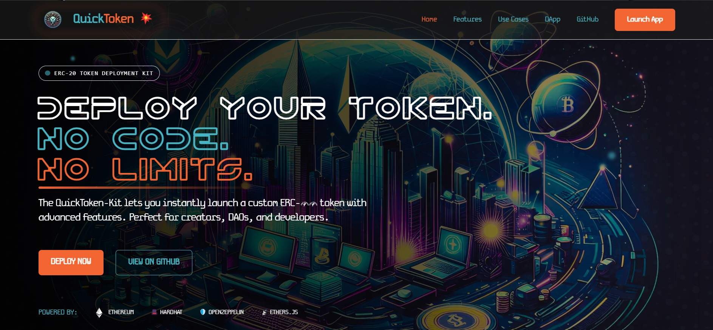

# QuickToken Platform

A complete platform for ERC-20 token creation, deployment, and management on Ethereum-compatible networks.



## Platform Overview

QuickToken Platform consists of two main components:

1. **Smart Contract Template** - A production-ready ERC-20 token implementation with advanced features
2. **Web Application** - A modern web interface for deploying and managing tokens

## 🌟 Key Features

- **⚡ Complete Token Solution**: Everything needed to launch and manage ERC-20 tokens
- **💰 Built-in Monetization**: Generate revenue through customizable mint fees
- **🔒 Advanced Security**: Time-lock protection and owner-only functions
- **🔥 Token Economics**: Built-in supply management with burning capabilities
- **🌐 Multi-Network Support**: Deploy to Ethereum, Polygon, Base, Optimism, and other EVM chains
- **📊 Administrative Dashboard**: Track and manage all token deployments
- **👥 Client Management**: Associate tokens with clients and track relationships
- **📱 Responsive Design**: Full functionality on both desktop and mobile devices

## 📋 Repository Structure

This repository is organized as follows:

```
quicktoken-platform/
├── contracts/           # Smart contract source code
├── scripts/             # Deployment and management scripts
├── test/                # Contract test suite
├── config/              # Configuration files
├── quicktoken-kit-web/  # Web application 
└── docs/                # Documentation
```

## Smart Contract Template

The smart contract template is a professionally designed ERC-20 token with features specifically tailored for creators, small DAOs, and developers who want to launch their own token with passive income features.

### Contract Features

- Standard ERC-20 compatibility
- Built on OpenZeppelin contracts for maximum security
- Customizable minting function with optional fee
- Time-lock mechanism for controlled token releases
- Burning capability for token supply management
- Owner-only privileged functions
- Comprehensive test coverage

### Contract Deployment

See the [Contract Deployment Guide](./docs/contract-deployment.md) for detailed instructions on deploying the smart contract directly.

## Web Application

The web application provides a user-friendly interface for deploying and managing tokens, with both public-facing and administrative features.

### Web App Features

- Token deployment wizard with simple configuration
- Token management dashboard for tracking deployments
- Administrative interface for platform managers
- Client database for token attribution
- Multi-network selector for deploying to different chains
- Wallet connection with MetaMask (Phantom and Coinbase Wallet coming soon)
- Token explorer for viewing deployed tokens

### Web App Setup

See the [Web Application README](./quicktoken-kit-web/README.md) for detailed setup instructions.

## Getting Started

### Prerequisites

- Node.js v16 or later
- NPM or Yarn
- MetaMask or similar Ethereum wallet
- Infura account (free tier is sufficient)

### Quick Start

1. Clone this repository:

```bash
git clone https://github.com/Gcavazo1/QuickToken-Platform.git
cd QuickToken-Platform
```

2. Install dependencies for the contract:

```bash
npm install
```

3. Configure your environment variables:

```bash
cp config/.env.example config/.env
# Edit the .env file with your values
```

4. Set up the web application:

```bash
cd quicktoken-kit-web
npm install
cp .env.example .env.local
# Edit the .env.local file with your values
```

5. Run the web application in development mode:

```bash
npm run dev
```

6. Open [http://localhost:3000](http://localhost:3000) to view the application

## Deployment

### Contract Deployment

```bash
npx hardhat run scripts/deploy.js --network polygon
```

Or deploy to other supported networks:

```bash
npx hardhat run scripts/deploy.js --network [ethereum|sepolia|polygon|mumbai|base|optimism]
```

### Web App Deployment

The web application is optimized for deployment on Vercel. See the [Web Application README](./quicktoken-kit-web/README.md) for detailed deployment instructions.

## Fee Structure

The platform operates on a revenue-sharing model:

### Beta Period (Current)
- **Deployment Fee**: Free during beta (until May 25, 2025)
- **Platform Revenue Share**: 20% of all mint fees
- **Token Creator Share**: 80% of all mint fees

Visit the [pricing page](https://quicktoken-platform.dev/pricing) for more details.

## License

This software is proprietary and owned by Gabriel Cavazos (GigaCode). All rights reserved. See the [LICENSE](./LICENSE) file for details.

## Contact

For questions or support, please contact:

- Email: contact@gigacode.dev
- GitHub: [Gcavazo1](https://github.com/Gcavazo1)
