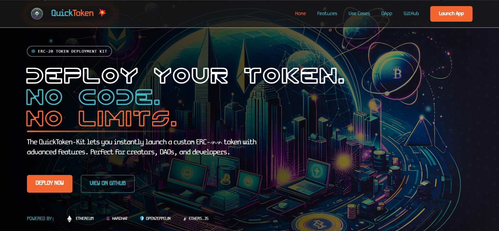

# QuickToken Platform Web Application

A professional web interface for deploying, managing, and interacting with ERC-20 tokens created using the QuickToken smart contract template.



## Features

- 🌐 **Modern Web Interface**: Built with Next.js, React, and Tailwind CSS
- 🔐 **Web3 Integration**: Connect with MetaMask (Phantom and Coinbase Wallet coming soon)
- 📊 **Token Management**: Deploy, track, and manage your tokens
- 👤 **Admin Dashboard**: Secure administrative controls
- 🔄 **Multi-Network Support**: Deploy to Ethereum, Polygon, Base, Optimism, and other EVM networks
- 📱 **Responsive Design**: Works on desktop and mobile devices
- 🔍 **Token Explorer**: View and interact with deployed tokens
- 💰 **Revenue Sharing Model**: Platform fee and token creator revenue split for each mint

## Technology Stack

- **Frontend**: Next.js, React, TypeScript
- **Styling**: Tailwind CSS, Headless UI
- **Web3**: Ethers.js, Web3-React
- **Database**: Supabase
- **Authentication**: Wallet-based authentication
- **State Management**: React Query

## Fee Structure

The platform operates on a revenue-sharing model:

### Beta Period (Current)
- **Deployment Fee**: Free during beta (until May 25, 2025)
- **Platform Revenue Share**: 20% of all mint fees
- **Token Creator Share**: 80% of all mint fees

### Post-Beta Plans
After the beta period, users will have two pricing options:

1. **Standard Plan**
   - One-time deployment fee: $40-80 ETH
   - Platform revenue share: 18%
   - Token creator revenue share: 82%

2. **Zero Upfront Plan**
   - No deployment fee
   - Platform revenue share: 25-30%
   - Token creator revenue share: 70-75%

For more details, see our [Fee Structure Documentation](../docs/fee-structure.md) or visit our [Pricing Page](/pricing).

## Getting Started

### Prerequisites

- Node.js 18+ and npm/yarn
- MetaMask or another Ethereum wallet
- Supabase account (for database functionality)
- Infura account (for blockchain access)

### Installation

1. Clone the repository:
```bash
git clone https://github.com/Gcavazo1/QuickToken-Platform.git
cd QuickToken-Platform/quicktoken-kit-web
```

2. Install dependencies:
```bash
npm install
# or
yarn install
```

3. Set up environment variables:
```bash
cp .env.example .env.local
```
Then edit `.env.local` to add your API keys and configuration values.

4. Start the development server:
```bash
npm run dev
# or
yarn dev
```

5. Open [http://localhost:3000](http://localhost:3000) in your browser to see the application.

## Environment Variables

Create a `.env.local` file with the following variables:

```
# Network Configuration
NEXT_PUBLIC_ETHEREUM_NETWORK=sepolia
NEXT_PUBLIC_INFURA_PROJECT_ID=your_infura_project_id
NEXT_PUBLIC_ETHERSCAN_API_KEY=your_etherscan_api_key
NEXT_PUBLIC_CONTRACT_ADDRESS=your_deployed_contract_address

# Supabase Configuration
NEXT_PUBLIC_SUPABASE_URL=your_supabase_url
NEXT_PUBLIC_SUPABASE_ANON_KEY=your_supabase_anon_key

# Fee Configuration
NEXT_PUBLIC_PLATFORM_WALLET_ADDRESS=your_platform_wallet_address
NEXT_PUBLIC_PLATFORM_FEE_PERCENTAGE=20
NEXT_PUBLIC_DEFAULT_MINT_FEE=0.01

# WalletConnect Configuration (optional for future wallet integrations)
NEXT_PUBLIC_WALLETCONNECT_PROJECT_ID=your_walletconnect_project_id

# Blockchain Network Configuration
NEXT_PUBLIC_DEFAULT_CHAIN=sepolia
```

## Supabase Setup

The platform uses Supabase for database functionality. You'll need to create the following tables:

1. Run the SQL setup script from the project root:
```bash
psql -h your_supabase_host -d postgres -U postgres -f supabase-setup.sql
```

Or manually create the tables using the Supabase web interface with the SQL script provided in `supabase-setup.sql`.

## Supported Networks

The platform currently supports the following networks:

| Network | Type | Description |
|---------|------|-------------|
| Ethereum Mainnet | Production | Main Ethereum network for live tokens |
| Polygon | Production | Low-fee alternative for high-volume applications |
| Base | Production | Coinbase-backed L2 with low fees |
| Optimism | Production | Layer 2 solution with Ethereum security |
| Sepolia | Testnet | Testing environment for Ethereum |
| Mumbai | Testnet | Testing environment for Polygon |

## Token Deployment Success

After successful token deployment, users will see a confirmation screen with:

- Token details (name, symbol, supply, network)
- Contract address with copy and Etherscan view options
- Transaction hash with copy and Etherscan view options
- Options to view the contract on Etherscan or deploy another token

## Build for Production

```bash
npm run build
# or
yarn build
```

Then start the production server:
```bash
npm run start
# or
yarn start
```

## Deployment

This application is optimized for deployment on Vercel. Follow these steps:

1. Push your repository to GitHub
2. Connect your GitHub repository to Vercel
3. Configure the environment variables in Vercel
4. Deploy

## Project Structure

```
quicktoken-kit-web/
├── public/                # Static assets
├── src/
│   ├── components/        # React components
│   │   ├── admin/         # Admin-specific components
│   │   └── ...            # Other components
│   ├── contracts/         # Contract ABIs and addresses
│   ├── lib/               # Utility libraries
│   ├── pages/             # Next.js pages
│   │   ├── admin/         # Admin dashboard pages
│   │   ├── api/           # API routes
│   │   └── ...            # Other pages
│   ├── styles/            # Global styles
│   └── utils/             # Utility functions
├── .env.example           # Example environment variables
├── next.config.js         # Next.js configuration
├── package.json           # Dependencies and scripts
├── tailwind.config.js     # Tailwind CSS configuration
└── tsconfig.json          # TypeScript configuration
```

## License

This software is proprietary and owned by Gabriel Cavazos (GigaCode). All rights reserved.

## Contact

For questions or support, please contact:
- Email: contact@gigacode.dev
- GitHub: [Gcavazo1](https://github.com/Gcavazo1) 